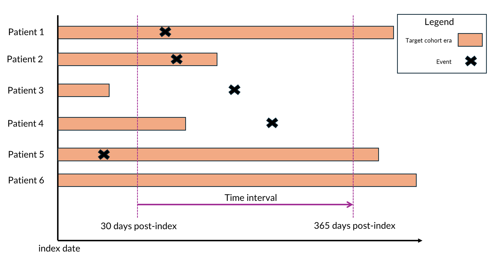
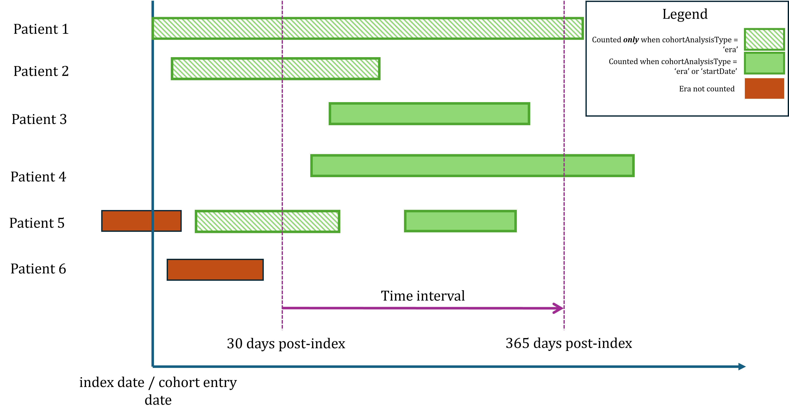

```{r, include = FALSE}
knitr::opts_chunk$set(
  collapse = TRUE,
  comment = "#>"
)
```

# Introduction


`ClinicalCharacteristics` allows users to summarize the number of patients who are observed to have presence of a clinical event during a time interval relative to the target cohort index date. Currently the package only supports the use of “earliest event cohort” where there is one cohort entry per patient. 

For example, we might want to characterize a cohort by condition occurrences that take place 30 to 365 days after index. However, we have found there are different ways of summarizing the presence of an event based on how we choose to apply a patient’s observation period and how we evaluate presence of occurrences (i.e., based on the span of patient time versus discrete start dates). Summarizing “presence of a clinical event” can lead to very different results depending on the choices we make in `ClinicalCharacteristics`.


This vignette present methods of characterizing events in a target population. First, we explain the difference between two different methods of counting patients in a cohort that experience a clinical event during a time interval: 'Any Presence' and 'Observed Presence'. Second, we distinguish between summarizing covariate cohorts anchored on cohort start date versus cohort era overlap. 

To demonstrate how to use the various methods of characterizing events within `ClinicalCharacterists`, we perform an experiment with a simple hypertension cohort. Finally, we visualize the results to show how choices in methods lead to different counts of patients.


## Any vs Observed Presence

One option for counting the presence of clinical event is whether we want to count “any” event or only “observed” events. “Observed” events only count when the event has occurred within the specified time interval and occur during the patient’s time in the cohort. “Any” events count when the event has occurred within the specified time interval regardless of the patient’s observation period. In both cases the denominator for the percentage is the same — the number of persons in the cohort of interest. Figure 1 shows an example to differentiate the two methods. If using “any”,  patients 1, 2, 3, and 4 are counted. If using “observed” we exclude patients 3 and 4 from the count because the event does not occur during the same observed time. We can configure these different options in `ClinicalCharacteristics` depending on which characterization is best suited for the study.



# Setup

## Creating target cohorts

First we use `Capr` to create a simple target cohort of patients who have experienced at least one condition occurrence of hypertension with a continuous observation window of 1 year prior to the index date.

```{r eval=FALSE}
# create hypertenison concept set
htn_cs <- Capr::cs(Capr::descendants(320128), name = "Hypertension")

# create hypertension cohort
htn_cohort <- Capr::cohort(
  entry = Capr::entry(
    Capr::conditionOccurrence(conceptSet = htn_cs),
    observationWindow = Capr::continuousObservation(priorDays = 365L),
    primaryCriteriaLimit = "First"
  ),
  attrition = Capr::attrition(expressionLimit = "First"),
  exit = Capr::exit(
    endStrategy = Capr::observationExit()
  )
)

```

## Creating drug usage covariate cohorts

Next we use `Capr` to create two drug exposure cohorts using definitions from the [Book of OHDSI](https://ohdsi.github.io/TheBookOfOhdsi/CohortDefinitions.html#ACEiUse). 

### Ace Inhibitor usage covariate cohort
```{r eval=FALSE}
# create ace inhibitor concept set
ace_cs <- Capr::cs(
  Capr::descendants(1308216,1310756,1331235,1334456,1335471,1340128,1341927,1342439,1363749,1373225),
  name = "Ace Inhibitor Usage"
)

# create ace inhibitor cohort
ace_use_cohort <- Capr::cohort(
  entry = Capr::entry(
    Capr::drugExposure(conceptSet = ace_cs),
    observationWindow = Capr::continuousObservation(priorDays = 0L),
    primaryCriteriaLimit = "First"
  ),
  attrition = Capr::attrition(expressionLimit = "First"),
  exit = Capr::exit(
    endStrategy = Capr::drugExit(conceptSet = ace_cs)
  )
)

```


### Angiotensin Receptor Blockers (ARB) usage covariate cohort 
```{r eval=FALSE}
# create arb concept set
arb_cs <- Capr::cs(
  Capr::descendants(1308842,1317640,1346686,1347384,
                    1351557,1367500,40226742,40235485), 
  name = "ARB Usage"
)

# create arb cohort
arb_use_cohort <- Capr::cohort(
  entry = Capr::entry(
    Capr::drugExposure(conceptSet = arb_cs),
    observationWindow = Capr::continuousObservation(priorDays = 0L),
    primaryCriteriaLimit = "First"
  ),
  attrition = Capr::attrition(expressionLimit = "First"),
  exit = Capr::exit(
    endStrategy = Capr::drugExit(conceptSet = arb_cs)
  )
)

```

## Create a definition set dataframe for the three cohorts

Next, we combine the cohort definitions into a dataframe with `Capr::makeCohortSet`.

```{r eval=FALSE}
cohortDefinitionSet <- Capr::makeCohortSet(htn_cohort, arb_use_cohort, ace_use_cohort)
```

## Connect to the database

To build these cohorts we must connect to our OMOP dbms and generate the set to
a schema with write access. Replace the template below with your omop dbms credentials
in order to continue with the vignette. 

```{r eval=FALSE}

# provide connection details
connectionDetails <- DatabaseConnector::createConnectionDetails(
  dbms = "my_dbms",
  user = "my_user",
  password = "secret",
  connectionString = "connection_string"
)
# connect to database
connection <- DatabaseConnector::connect(connectionDetails)

```

## Generate cohorts

Next we use `CohortGenerator` to create an empty cohort table in a scratch database schema that will be populated with patients for the three cohorts in cohortDefinitionSet.

```{r eval=FALSE}

# find cohort table names
cohortTableNms <- CohortGenerator::getCohortTableNames(
  cohortTable = "study_cohort_table"
)


CohortGenerator::createCohortTables(
  connection = connection,
  cohortDatabaseSchema = executionSettings$workDatabaseSchema,
  cohortTableNames = cohortTableNms,
  incremental = TRUE
)

cohortsGenerated <- CohortGenerator::generateCohortSet(
  connection = connection,
  cdmDatabaseSchema = "my_cdm",
  cohortDatabaseSchema = "my_cohorts",
  cohortTableNames = cohortTableNms,
  cohortDefinitionSet = cohortDefinitionSet,
  tempEmulationSchema = "temp_schema"
)

```

# How to use ClinicalCharacteristics

In this section we will demonstrate how to use Clinical Characteristics to characterize our hypertension cohort. This section will review the syntax required to prepare the table shell object and then generate. 

## Experiment 1

In our first experiment we will look at the difference between any and observed count when characterizing the Hypertension cohort. To run this experiment we need to:

- identify the cohorts and concept sets used for the characterization
- define our time intervals for analysis
- set up our execution settings and build options to run the characterization
- build the table shell
- generate the results

## Preparing the table shell

First we set up the assets use for the characterization. Our target cohort is Hypertension. Then we use concept sets of Chronic Kidney Disease, Heart Failure, and Coronary Artery Disease and add them to a list. 

```{r eval=FALSE}

condition_cs_batch <- list(
  Capr::cs(Capr::descendants(46271022), name = "ckd"),
  Capr::cs(Capr::descendants(316139), name = "hf"),
  Capr::cs(Capr::descendants(35205164), name = "cad")
)
```

Finally we identify the cohort covariates we want to use for the characterization. 

```{r eval=FALSE}
covariate_cohorts <- list(
  ClinicalCharacteristics::createCohortInfo(id = 2, name = "Ace Inhibitor Usage"),
  ClinicalCharacteristics::createCohortInfo(id = 3, name = "Angiotensin Receptor Blockers Usage")
  )
```

Next up, we define our time intervals of interest. We create a list of timeInterval objects with left and right bounds relative to the index date.

```{r eval=FALSE}

time_windows <- list(
  ClinicalCharacteristics::timeInterval(lb = -730, rb = -1),
  ClinicalCharacteristics::timeInterval(lb = -365, rb = -1),
  ClinicalCharacteristics::timeInterval(lb = 0, rb = 30),
  ClinicalCharacteristics::timeInterval(lb = 31, rb = 90),
  ClinicalCharacteristics::timeInterval(lb = 0, rb = 365),
  ClinicalCharacteristics::timeInterval(lb = 366, rb = 720),
  ClinicalCharacteristics::timeInterval(lb = 0, rb = 9999)
)
```

Next we set up the execution settings and build options for the analysis. Typically we use the default build options which uses a set of temp tables to evaluate the shell. 

```{r eval=FALSE}

executionSettingsForClinChar <- ClinicalCharacteristics::createExecutionSettings(
    connectionDetails = connectionDetails,
    cdmDatabaseSchema = "my_cdm",
    workDatabaseSchema = "my_cohorts",
    tempEmulationSchema = "temp_schema",
    cohortTable = "study_cohort_table",
    cdmSourceName = "my_cdm_source"
  )

buildOps <- ClinicalCharacteristics::defaultTableShellBuildOptions()
```

## Create a new table shell

Add the line items for the condition concept sets and drug covariate cohorts and set the statistic parameter equal to anyPresenceStat() or ObservedPresenceStat(). In this case we create line item batches for anyPresenceStat() and ObservedPresenceStat() to compare the differences in the number of patients counted using each method. 

```{r eval=FALSE}

ts <- ClinicalCharacteristics::createTableShell(
  title = " Hypertension Experiment 1",
  targetCohorts = list(
    ClinicalCharacteristics::createCohortInfo(id = 1, name = "Hypertension")
    ),
  lineItems = ClinicalCharacteristics::lineItems(
    ClinicalCharacteristics::addDefaultGenderLineItems(),
    ClinicalCharacteristics::addDefaultEthnicityLineItems(),
    ClinicalCharacteristics::createDemographicLineItem(
      ClinicalCharacteristics::raceCategory()
      ),
    ClinicalCharacteristics::createDemographicLineItem(
      ClinicalCharacteristics::ageCharCts()
      ),
    ClinicalCharacteristics::createDemographicLineItem(
      ClinicalCharacteristics::ageCharBreaks(
        breaks = ClinicalCharacteristics::age5yrGrp()
        )
      ),
    ClinicalCharacteristics::createConceptSetLineItemBatch(
      sectionLabel = "Conditions Any Presence",
      domain = "condition_occurrence",
      statistic = ClinicalCharacteristics::anyPresenceStat(),
      conceptSets = condition_cs_batch,
      timeIntervals = time_windows
    ),
    ClinicalCharacteristics::createConceptSetLineItemBatch(
      sectionLabel = "Conditions Observed Presence",
      domain = "condition_occurrence",
      statistic = ClinicalCharacteristics::observedPresenceStat(),
      conceptSets = condition_cs_batch,
      timeIntervals = time_windows
    ),
    ClinicalCharacteristics::createCohortLineItemBatch(
      sectionLabel = "Drug Cohorts Any Presence",
      covariateCohorts = covariate_cohorts,
      cohortTable = executionSettings$cohortTable,
      timeIntervals = time_windows,
      statistic = ClinicalCharacteristics::anyPresenceStat()
    ),
    ClinicalCharacteristics::createCohortLineItemBatch(
      sectionLabel = "Drug Cohorts Observed Presence",
      covariateCohorts = covariate_cohorts,
      cohortTable = executionSettings$cohortTable,
      timeIntervals = time_windows,
      statistic = ClinicalCharacteristics::observedPresenceStat()
    )
  )
)
```

Once the the table shell is created, we will generate the table shell to extract our results. 


```{r eval=FALSE}
res <- ClinicalCharacteristics::generateTableShell(
  tableShell = ts, 
  executionSettings = executionSettingsForClinChar,
  buildOptions = buildOps
)
```


# Experiment 2: Cohort Era vs Start Date

When characterizing a target cohort by covariate cohorts, we need to determine whether we count an event as present within a time interval using the cohort start date or any covariate cohort era overlap with the interval. Recall that cohorts have an entry and exit date. For example, a drug era cohort starts on the first exposure and persists based on continuous exposure. With this logic, the exposure time is not limited to the start date, but the duration of active exposure, and we want to enumerate the presence of an event as such. With `FeatureExtraction`, characterizing covariate cohorts can only be done based on cohort era overlap, whereas `ClinicalCharacteristics` provides options for both. 

The figure below demonstrates the difference in enumerating patients based on the cohort era or the start date. Patients 3 and 4 have eras that start after the time interval start date so they would be counted using either analysis type. Patient 5 would qualify under either analysis type because they have an era that overlaps with the time interval start and an era that starts within the time interval. Patient 6 would not be counted by either method because the era does not overlap with the time interval.



To run this experiment, we create two buildOptions objects with the cohortAnalysisType parameter set to either "era" and "startDate". 


```{r eval=FALSE}
buildOptionsEra <- ClinicalCharacteristics::defaultTableShellBuildOptions(cohortAnalysisType = "era")
buildOptionsStartDate <- ClinicalCharacteristics::defaultTableShellBuildOptions(                          cohortAnalysisType = "startDate") 
```

These two options set how we want to enumerate a cohort covariate in the characterization. As before we set up the table shell and generate the results. 

```{r eval=FALSE}


ts_2 <- ClinicalCharacteristics::createTableShell(
  title = " Hypertension Experiment 2",
  targetCohorts = list(
    ClinicalCharacteristics::createCohortInfo(id = 1, name = "Hypertension")
  ),
  lineItems = ClinicalCharacteristics::lineItems(
    ClinicalCharacteristics::createCohortLineItemBatch(
      sectionLabel = "Drug Cohorts Any Presence",
      covariateCohorts = covariate_cohorts,
      cohortTable = executionSettings$cohortTable,
      timeIntervals = time_windows,
      statistic = ClinicalCharacteristics::anyPresenceStat()
    )
  )
)
result_era <- generateTableShell(ts_2, executionSettingsForClinChar, buildOptions = buildOptionsEra)
result_startDate <- generateTableShell(ts_2, executionSettingsForClinChar, buildOptions = buildOptionsStartDate)

```
